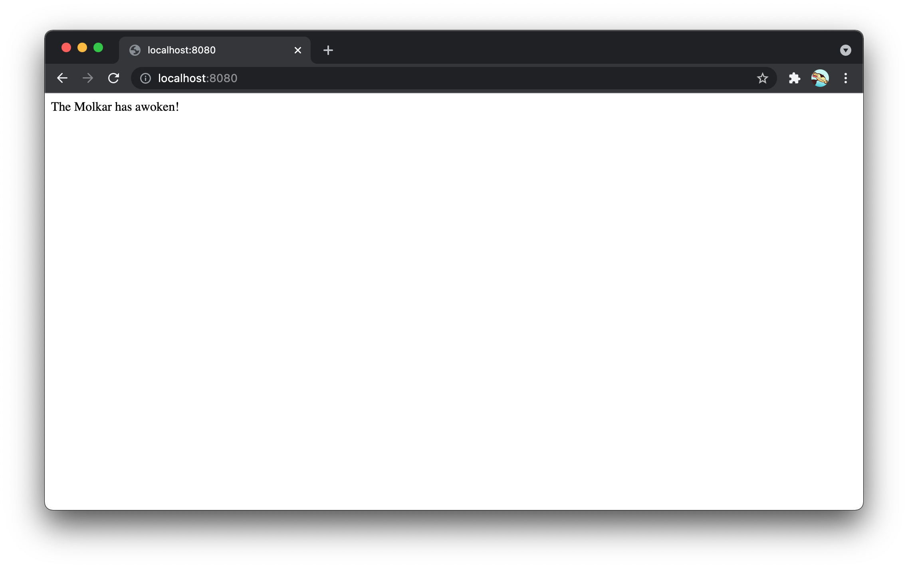

<br />
<h1>
<p align="center">
  
  <br>Molkar
</h1>
  <p align="center">
    An example node.js app with docker, created to learn Google cloud
    </p>
</p>

## Install

```sh
npm install
```

## Usage

```sh
npm start
```

## 🐳 Build image

```sh
docker build -t molkar .
```

## 🐳 Run image in detached mode and open ports `8080`


```sh
docker run -dp 8080:8080 molkar
```

**Example output**


## Credits
- Credit to [Google](https://google.com)
- Thanks to [Google](https://google.com)